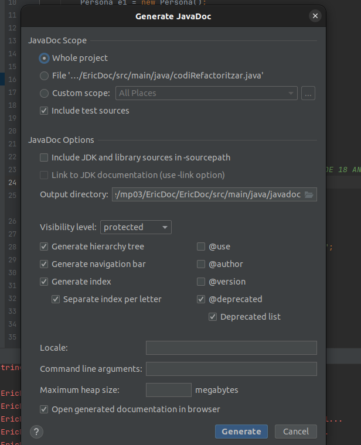
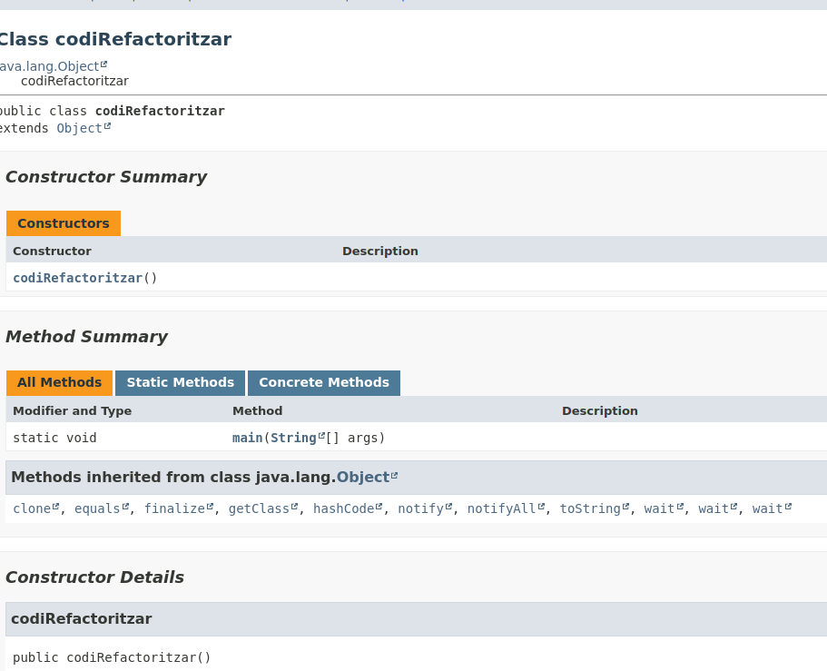

Activitat Documentació.
Aquesta activitat és individual.

1- Comentar el codi (de forma útil, no obvia) i fer servir JavaDocs per cada funció i classe que feu servir.
Una bona forma de comentar el codi normalment utilitzant JavaDoc es utilitzar els caracters " /** " i també fer "param"

2- Després de comentar totes les clases, anirem a Tools --> Generar JavaDoc i especificar un directori.

3- Per finalitzar, sen's generarà un fitxer index.html on podem consultar com ha quedat la nostra documentació.

